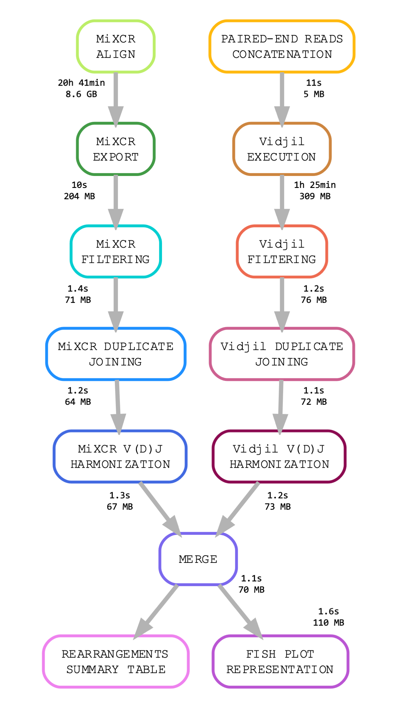

# cloneIG: Clonality testing of immunoglobulins in patients with Multiple Myeloma

## Introduction

**cloneIG** is a Snakemake pipeline that performs clonality testing of immunoglobulins (Ig) using different sample data from the same patient. The pipeline is able to analyze sequencing data harmonizing the results of two specialized software ([*MiXCR*](https://mixcr.readthedocs.io/en/master/) and [*Vidjil*](https://www.vidjil.org/doc/vidjil-algo/)) and obtaining a summary table with the combined results. The pipeline also generates fish plot representations of rearrangement frequencies to compare between different sample conditions.

The pipeline integrates with the Conda package manager control software requirements and dependencies.

## Workflow overview

This is the DAG of the complete workflow that included CPU time and RAM usage per rule.

## Author

 * Andrea Sánchez de la Cruz
 
## Setup

A demo *cloneIG* analysis environment was generated to test MM129 sequencing data. For that purpose, a bash executable was created to modify the desired parameters and the location of input/output files in two configuration files. Detailed information is described in the *Usage* section.

### Configuration files

* **config.yaml** contains pipeline parameters.
* **cloneIG_demo_config.csv** contains sample information and their paths.
* **cloneIG.sh**: bash script that modifies the previous config files according to desired user parameters.

### Input files

* Sequencing data in FASTQ format

## Usage 

### 1. Set up the environment 

cloneIG requires the conda package manager to be installed. Install conda by following the [bioconda instructions](http://bioconda.github.io/user/install.html#install-conda). Snakemake 7.8.0 installation is also required [Snakemake documentation](https://snakemake.readthedocs.io/en/stable/getting_started/installation.html). 

### 2. Download cloneIG repository from GitHub.

Use git clone command to create a local copy via HTTPS 

    git clone https://github.com/asdc-tfm/cloneIG.git
    
or SSH

    git clone git@github.com:asdc-tfm/cloneIG.git

### 3. Configure the pipeline.

Modification of config files and snakemake execution is automatized using the cloneIG.sh bash script. The user must run this command, given the following parameters:

    bash cloneIG.sh -i <config_csv> -o <out_dir> -t <total_threads> -m <mixcr_threads>
   
* -i <config_csv> CSV config file
* -o <out_dir> (optional) Output directory. Default current directory.
* -t <total_threads> (optional) Number of threads assigned to Snakemake execution. Default 1.
* -m <mixcr_threads> (optional) Number of threads assigned to MiXCR execution rules. Default 1.

> REQUIREMENTS: *MiXCR* execution needs at least 8 GB RAM.

#### **config.yaml**

This is the pipeline configuration file that contains the CSV config file path (`-i` cloneIG.sh argument), output path and log path (`-o` cloneIG.sh argument), as well as specific rule resources (`-t` and `-m` cloneIG.sh arguments). A example config.yaml file is available in the repository.

#### **cloneIG_demo_config.csv**

This file is used to indicate the FASTQ input paths.

A example cloneIG_demo_config.csv file is available in the repository. The following table summarizes its content:

| **Patient**	| **Condition**	| **Sample** 	| **R1** 	| **R2** |
|-------------	|--------------	|----------------	|------------------	|------------------	|
| **MM129** 	| BM	| MM129_BM	|{user_path}/TFM/data/MM129/MM129_R1_BM.fastq.gz}	|{user_path}/TFM/data/MM129/MM129_R2_BM.fastq.gz|
| **MM129** 	| PPC	| MM129_PPC	|{user_path}/TFM/data/MM129/MM129_R1_PPC.fastq.gz}	|{user_path}/TFM/data/MM129/MM129_R2_PPC.fastq.gz|
| **MM129** 	| cfDNA	| MM129_cfDNA	|{user_path}/TFM/data/MM129/MM129_R1_cfDNA.fastq.gz}	|{user_path}/TFM/data/MM129/MM129_R2_cfDNA.fastq.gz|

The first three columns refer to patient and sample type. R1 and R2 columns indicate fastq files path, specified to cloneIG.sh 

### 4. Run the pipeline.

cloneIG bash script automatically executes snakemake after modification of config files using the following command:

    snakemake --use-conda -c <total_threads>

* **--use-conda**: to install and use the conda environments.
* **-c**: number of cores provided to execute snakemake.

## Pipeline steps

* **A. Software execution** (rules: mixcr_align, mixcr_export, vidjil): MiXCR and Vidjil execution commands.

* **B. Software output filtering** (rules: filter_mixcr, filter_vidjil): filter full_clones.txt MiXCR and tsv Vidjil outputs and obtain a standardized CSV file with the same parameters for both tools per patient.

* **C. Duplicates joining** (rules: join_mixcr_duplicates, join_vidjil_duplicates): parse filtered MiXCR and Vidjil csv files to join those rows that share an identical CDR3 sequence (or equal VDJ name when CDR3 is missing) for the same condition

* **D. V(D)J harmonization** (rules: harmonize_VDJ_mixcr, harmonize_VDJ_vidjil): standardize MiXCR and Vidjil V(D)J nomenclature.

* **E. Software output merge** (rule: merge): merge MiXCR and Vidjil rearrangements of the same patient at different conditions. This merge was based on the CDR3 sequence, considered as clonal identifier. Summary table is obtained in a CSV file.

* **F. Fish plot generation** (rule: get_fishplot rule): obtain fish plot representation in HTML format for each tool per patient u sing the information of the summary table CSV file.

---
